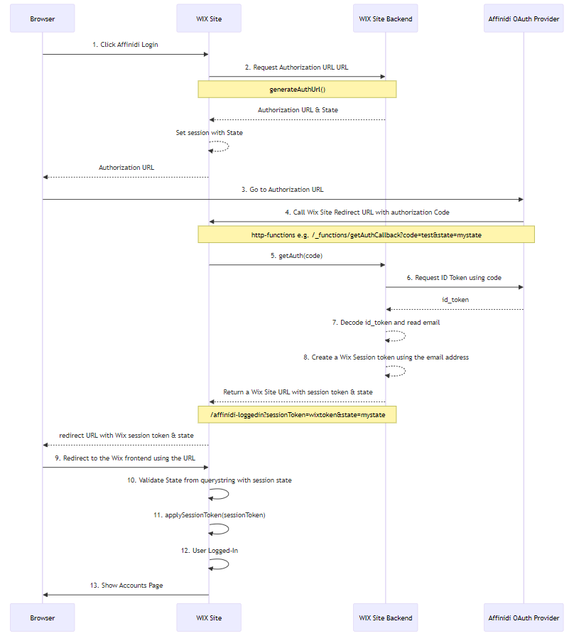

# WIX - Affinidi Login Integration

This is Custom App, which helps for Affinidi Login Integration with sites built on WIX platform 

## OAuth Flow


## Setup

### How to Use the Package in your Site
1. Install the package

2. Import the package in your code:

To import backend functions, use the following syntax:

```
import { <functionName> } from '@<username>/<package-name>-backend'
```
e.g.
```
import { getAuth } from '@parameshk9/affinidi-sso-integration-backend'
```


To import public functions, use the following syntax:

```
import { <functionName> } from '@<username>/<package-name>'
```
e.g.
```
import { getAuthUrl } from '@parameshk9/affinidi-sso-integration';
```

### Create Affinidi Login Config & Configure in WIX

1. Create a Affinidi Login Config, with below redirect URL as `https://{WIX_SITE}/_functions/getAuthCallback`, replace your WIX site url 

2. Open the Wix Secrets Manager to securely store the client secret. This is more secure than pasting them into backend code. Make sure never to expose your client's secrets.

Create a new secret called `affinidi-sso-credentials`.

Copy-paste the content of the JSON file downloaded in the previous section into the value for the secret. as displayed below:
```
{
  "client_id": "<YOUR_CLIENT_ID>",
  "client_secret": "<YOUR_CLIENT_SECRET>",
  "issuer": "<ISSUER_URL>",
  "code_verifier": "<ANY_43_CHARACTER_LENGH_SECRET_STRING>"
}
```
Sample looks like 
```
{
    "client_id": "18b556d6-81fd-44d2-9de9-829beb95bf06",
    "client_secret": "a1234aLLhNGs8DoXUwV_jHe9VZn7",
    "issuer": "https://427cc658-ddf8-4e5e-93b3-c038c13fac19.apse1.login.affinidi.io",
    "code_verifier": "affinidissoabc-klDgGJkAEho7OMAu1qG02LKlFEfPWJztMaq2Lb7b8hI"
}
```
Note: Make sure that the object is in correct JSON format, including all quotes. If not, the Secrets Manager will not be able to read the object properly, resulting in incorrect Affinidi SSO credentials.


### How to Use the Package

1. Add Login Button to Login Page Or Drag & Drop the Login widget(Contain button+click logic)
```
import { getAuthUrl } from '@parameshk9/affinidi-sso-integration';
import wixLocationFrontend from 'wix-location-frontend';

export async function affinidiLogin_click(event) {
	$w('#affinidiLogin').disable();
    console.log('Affinidi Login button clicked');
    try {
        const url = await getAuthUrl();
        wixLocationFrontend.to(url);

    } catch (error) {
        console.error(error);
        $w('#affinidiLogin').enable();
    }
}

```
2. In the Backend section of the Velo Sidebar, create an `http-functions.js` file. Copy the code below into this file to define a get_getAuthCallback function.

An http-functions.js backend file, to receive authentication from Affinidi.

Redirect URL : https://parameshk9.wixsite.com/paramesh-affinidi/_functions/getAuthCallback

```
import { ok, badRequest } from 'wix-http-functions';
import { getAuth } from '@parameshk9/affinidi-sso-integration-backend';

export function get_getAuthCallback(request) {
    console.log('callback called');
    return getAuth(request)
        .catch((error) => {
            console.log(error);
            let options = {
                "headers": {
                    "Content-Type": "application/json"
                },
                "body": {
                    "error": error.message
                }
            };
            return badRequest(options);

        });
}
```


3. Logged In Page - Auto-Login - to which the site visitor is redirected after authentication.

Create the “Affinidi Loggedin” page by copying the code below to the page in the Code panel.

The package code for this page uses the applyToken() function to apply the session token and updates the visitor’s indicating the visitor is logged in.

Logged In Page Code

```
import { applyToken } from '@parameshk9/affinidi-sso-integration'
import wixUsers from 'wix-users';
import wixLocationFrontend from 'wix-location-frontend';

$w.onReady(function () {
	console.log('logged in page initiated');
	applyToken(true).then(() => {
        // Gets user email
        wixUsers.currentUser.getEmail().then((email) => {
            console.log('user logged in', email);
        });
		wixLocationFrontend.to('/account/my-account');		
    }).catch(error => {
		console.error('error ', error);
		wixLocationFrontend.to('/');
	});

});

```