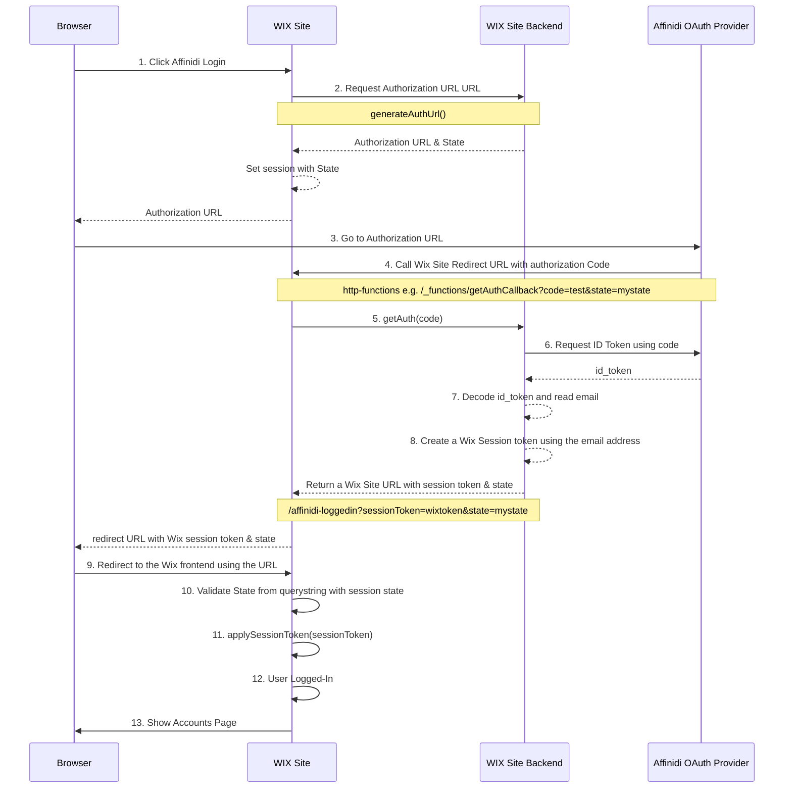

```mermaid
sequenceDiagram
    participant browser as Browser 
    participant wix as WIX Site 
    participant wixBe as WIX Site Backend 
    participant affinidi as Affinidi OAuth Provider

    browser->>wix: 1. Click Affinidi Login
    wix->>wixBe: 2. Request Authorization URL URL
    Note over wix, wixBe:  generateAuthUrl()
    wixBe-->>wix: Authorization URL & State
    wix-->>wix: Set session with State 
    wix-->>browser: Authorization URL
    browser->>affinidi: 3. Go to Authorization URL
    affinidi->>wix: 4. Call Wix Site Redirect URL with authorization Code
    Note over wix, affinidi: http-functions e.g. /_functions/getAuthCallback?code=test&state=mystate
    wix->>wixBe: 5. getAuth(code)
    wixBe->>affinidi: 6. Request ID Token using code
    affinidi-->>wixBe: id_token
    wixBe-->>wixBe: 7. Decode id_token and read email
    wixBe-->>wixBe: 8. Create a Wix Session token using the email address
    wixBe-->>wix: Return a Wix Site URL with session token & state
    Note over wixBe, wix: /affinidi-loggedin?sessionToken=wixtoken&state=mystate
    wix-->>browser: redirect URL with Wix session token & state
    browser->>wix: 9. Redirect to the Wix frontend using the URL
    wix->>wix: 10. Validate State from querystring with session state
    wix->>wix: 11. applySessionToken(sessionToken)
    wix->>wix: 12. User Logged-In
    wix->>browser: 13. Show Accounts Page
```