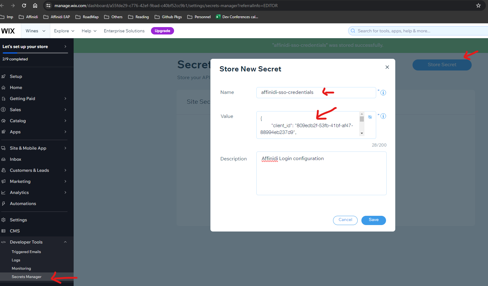

# WIX - Affinidi Login Integration

Simplify the integration of `Affinidi Login` into your Wix Sites.

## Prerequisites

Before getting started, make sure you have the following prerequisites:

1. Install [Affinidi Vault](https://docs.affinidi.com/labs/affinidi-login-basic/#before-you-begin-i-classfa-solid-fa-stari) to discover, collect, store, share, and monetise your data with consent.

2. Create Login configuration using the link [here](https://docs.affinidi.com/docs/affinidi-login/login-configuration/#create-a-login-configuration) by giving name as `Wix Site` and redirect-uri as `https://{WIX_SITE}/_functions/getAuthCallback` e.g. `https://parameshk9.wixsite.com/paramesh-affinidi/_functions/getAuthCallback`

3. Open the Wix Secrets Manager to securely store the client secret. This is more secure than pasting them into backend code. Make sure never to expose your client's secrets.

Create a new secret called `affinidi-sso-credentials`.

Copy-paste the below content, replace client id, client secret, issuer url with the value obtained in previous step:
```
{
  "client_id": "<YOUR_CLIENT_ID>",
  "client_secret": "<YOUR_CLIENT_SECRET>",
  "issuer": "<ISSUER_URL>",
  "code_verifier": "<ANY_43_CHARACTER_LENGH_SECRET_STRING>"
}
```

Sample value should look like: 
```
{
    "client_id": "18b556d6-81fd-44d2-9de9-829beb95bf06",
    "client_secret": "a1234aLLhNGs8DoXUwV_jHe9VZn7",
    "issuer": "https://427cc658-ddf8-4e5e-93b3-c038c13fac19.apse1.login.affinidi.io",
    "code_verifier": "affinidissoabc-klDgGJkAEho7OMAu1qG02LKlFEfPWJztMaq2Lb7b8hI"
}
```


3. Open Wix Site Editor


## Integration Setup

1. By default Wix does not allow any changes to Signup/Login Pages, To make the customization change the signup/login page form type from `Default` to `Custom Form` from menu item `Pages & Menu -> Signup & Login`

    

2. Create a new blank Page with the name `Affinidi LoggedIn` and some text like `Please Wait, We are logging you in....` and hide that page from menu item. This pages acts as Loading page and does the auto-login to Wix site once user is created.

    

3. Install the npm package `openid-client` by clicking on menu `Packages & Apps`

    

4. Open `Public & Backend` menu option to write frontend & backend code

Folder Structure should look like below, and you can copy the code for each file from [here](./src)
```
-- Public
    -- affinidi             /* Add folder */ 
        - client.js         /* Add new js file */ 
        - util.js           /* Add new js file */ 
-- Backend
    -- affinidi             /* Add folder */ 
        - affinidi.web.js   /* Add new web module file */ 
        - auth.js           /* Add new js file */ 
    - http-functions.js     /* Add js file, ignore it if already exists */ 
```
    


5. Open the `Custom Signup` and Add Element of type `Icon Button` with the below settings
    - Regular image as 
    - Hover image as 
    - Clicked image as 
    - Tooltip as `Affinidi Login`
    - ID as `affinidiLogin`
    - Add OnClick handler for the button, and below is the code for a button click 
    
```
import { getAuthUrl } from 'public/affinidi/client.js';
import wixLocationFrontend from 'wix-location-frontend';

export async function affinidiLogin_click(event) {
	console.log('Affinidi Login button clicked');
    try {
        const url = await getAuthUrl();
        wixLocationFrontend.to(url);

    } catch (error) {
        console.error(error);
    }
}
```


6. Open the `Custom Login` and Add Element of type `Icon Button` with the below settings
    - Regular image as 
    - Hover image as 
    - Clicked image as 
    - Tooltip as `Affinidi Login`
    - ID as `affinidiLogin2`
    - Add OnClick handler for the button with the code mentioned in previous step


7. Open the `Affinidi LoggedIn` and add the below code 
```
import { applyToken } from 'public/affinidi/client.js'
import wixUsers from 'wix-users';
import wixLocationFrontend from 'wix-location-frontend';

$w.onReady(function () {
	console.log('logged in page initiated');
	applyToken(true).then(() => {
        // Gets user email
        wixUsers.currentUser.getEmail().then((email) => {
            console.log('user logged in', email);
        });
		wixLocationFrontend.to('/account/my-account');		
    }).catch(error => {
		console.error('error ', error);
		wixLocationFrontend.to('/');
	});

});
```


8. Save the changes and publish it, Open site URL and click on `Affinidi Login` button under Signup/Login Page


